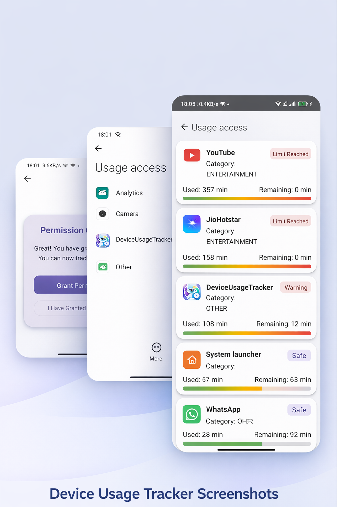
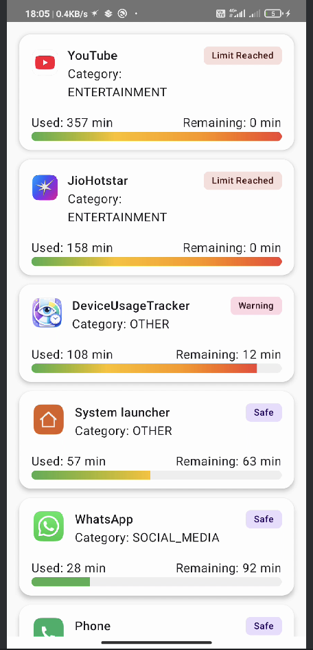
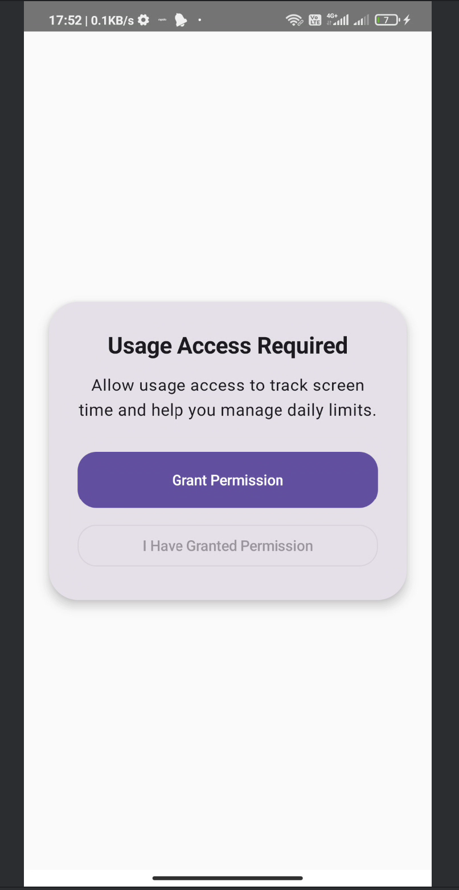
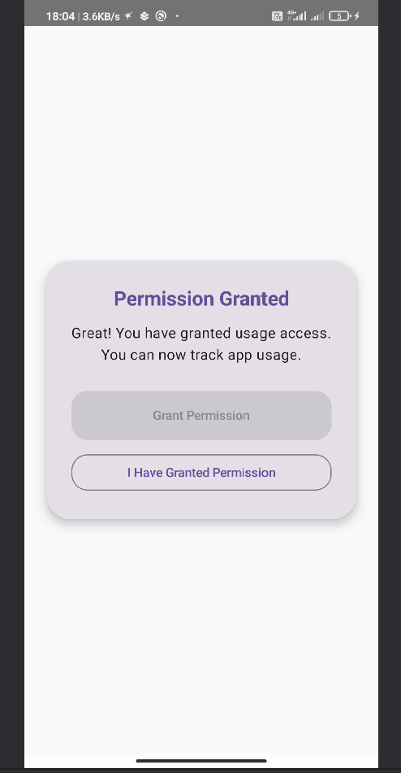
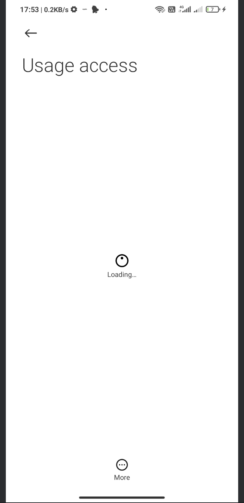
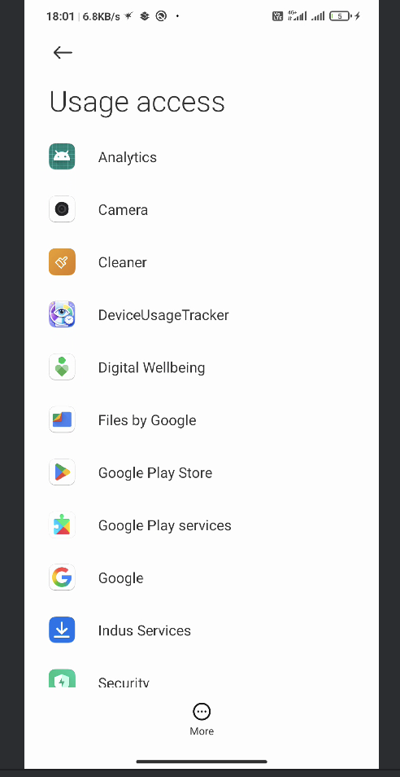
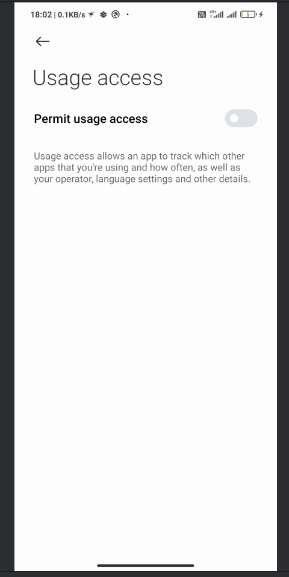
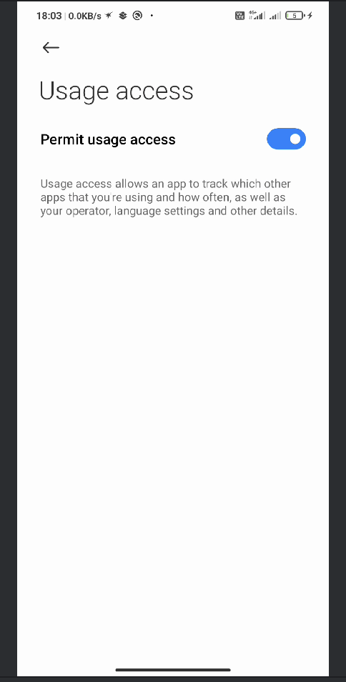

# 📱 Device Usage Tracker

 ## look

  
  
  
  
  

## Project Overview

Device Usage Tracker is an Android application that monitors device app usage and displays usage
insights in a clean dashboard UI.

The app is designed as a foundation for a Parental Control / Digital Wellbeing system, where
screen-time limits and enforcement mechanisms will be added incrementally.

## 📸 App Screenshots

  

###  Dashboard

  

### 🔐 Permission Flow

  
  

### 📱 Usage Access Screens

  

  
  
  

##  Current Implemented Features
### Permission Flow (On Launch)
-   Requests Usage Access permission at app launch
-   Redirects user to system Usage Access Settings
-   Handles permission grant / deny state properly

### App Usage Tracking
-   Retrieves daily app usage using system Usage Stats API
-   Tracks foreground usage per app
-   Calculates usage from start of day → current time

### Dashboard Screen (App Information Display)
Currently dashboard shows:
✔ App Icon
✔ App Name
✔ App Category
✔ Usage Time (minutes)
✔ Remaining Time (based on mock / base limit logic)
✔ Usage Progress Bar

### 🎨 UI Implementation
-   Built using Jetpack Compose
-   Material 3 design
-   Clean card-based dashboard layout

### Tech Stack
| Category     | Technology                   |
|--------------|------------------------------|
| Language     | Kotlin                       |
| UI           | Jetpack Compose + Material 3 |
| Architecture | MVVM + Repository Pattern    |
| Async        | Kotlin Coroutines            |
| Data Source  | UsageStatsManager            |
| Permission   | Usage Access Permission      |
| Background   | (Planned) Foreground Service |

### Project Architecture
presentation/
    dashboard/
    permission/
    viewmodel/

domain/
    model/

data/
    repository/
    manager/
    mapper/

utils/
    PermissionUtils    

##  Dependencies Used

### Core Android
androidx.core:core-ktx
androidx.lifecycle:lifecycle-runtime-ktx
androidx.lifecycle:lifecycle-viewmodel-ktx

### Jetpack Compose
androidx.compose.bom
androidx.compose.ui
androidx.compose.material3
androidx.activity.compose

### Coroutines
kotlinx:kotlinx-coroutines-android

### Room Database (Added, Future Usage)
androidx.room:room-runtime
androidx.room:room-ktx
androidx.room-compiler (kapt)

### Permission Used
android.permission.PACKAGE_USAGE_STATS

**Special Permission : This permission must be granted manually from system settings.**

### How Usage Is Calculated
-   Fetch usage stats from system
-   Filter apps with usage > 0
-   Convert milliseconds → minutes
-   Map apps → category
-   Calculate:
    -> Usage minutes
    -> Remaining minutes
    -> Progress percentage

### MVVM Architecture
Separates UI, business logic, and data sources.

### Minimum Requirements
-   Android 8.0 (API 26) or above
-   Usage Access Permission enabled

#  How To Run
##  Getting Started

### Prerequisites
- Android Studio Hedgehog or above
- Physical Android Device (Usage Stats may not work properly on emulator)
- Android 8.0+ (API 26)

### Setup Steps
1. Clone the repository
2. Open project in Android Studio
3. Sync Gradle
4. Run on physical device
5. Grant Usage Access Permission when prompted

## 🎯 Why This Project?

This project was built to deeply understand Android system-level APIs like UsageStatsManager,
foreground services, and permission flows.

It simulates real-world Digital Wellbeing / Parental Control scenarios such as:
- Screen time monitoring
- Usage limit enforcement
- Background monitoring services
- Real-time blocking triggers (planned)

## 🛣 Future Roadmap

### Phase 1 — Core Tracking 
- Usage stats tracking
- Dashboard UI
- Permission flow

### Phase 2 — Limit Engine (In Progress)
- Category based limits
- App based limits
- Daily reset logic

### Phase 3 — Enforcement Engine (Planned)
- Foreground monitoring service
- Limit breach notifications
- Blocking overlay screen
